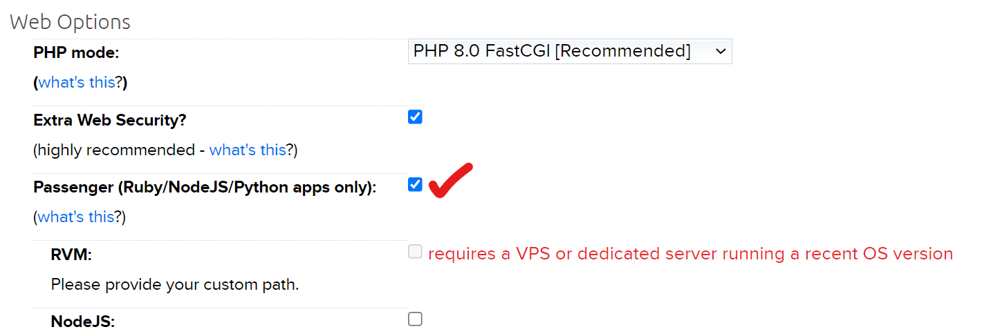
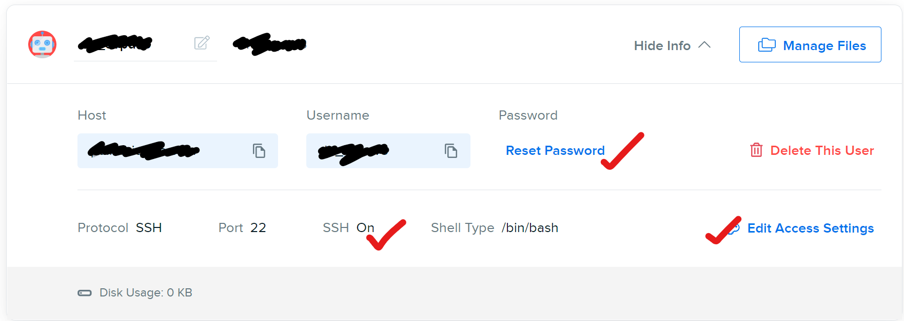
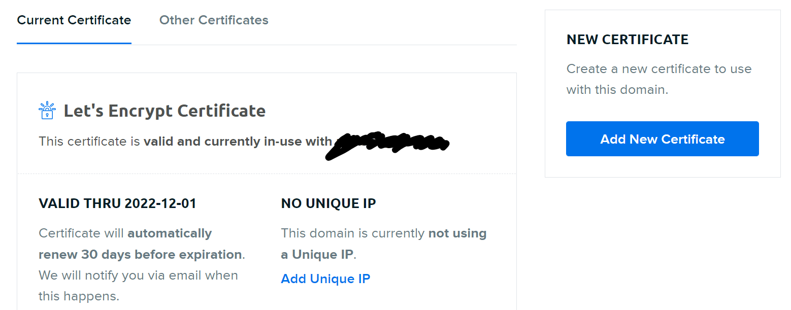

# DreamHost Shared Hosting Deployment

###Initial Setup

* Enable the Passenger (Ruby/NodeJS/Python apps only) box.

* Enable SSH for the user and reset password

* Add SSL certificate



###Install Python3

* SSH into your domain: ```ssh username@mydomain.com```
* Go to your project’s directory: ```cd project.domain.com```
* Execute the following commands:

```bash
mkdir ~/py3_tmp
cd ~/py3_tmp/
wget https://www.python.org/ftp/python/3.8.2/Python-3.8.2.tgz
tar zxvf Python-3.8.2.tgz 
cd Python-3.8.2
./configure --prefix=$HOME/opt/python-3.8.2
make
make install
echo 'export PATH=$HOME/opt/python-3.8.2/bin:$PATH' >> ~/.bash_profile
. ~/.bash_profile
```

###Create a virtual environment

* Check if pip is installed: ```python3 -m pip install --upgrade pip```
* Install virtualenv: ```pip3 install virtualenv```

* Check the folder: ```which virtualenv```:
```bash
[amphibius]$ which virtualenv
/home/dh_abcd123/opt/python-3.8.2/bin/virtualenv
```

* Check the folder  ```which python3```:
```bash
[amphibius]$ which python3
/home/dh_abcd123/project.domain.com/venv/bin/python3
```

* Create virtual environment using the path from the previous steps:
```bash
[amphibius]$ virtualenv -p /home/dh_abcd123/opt/python-3.8.2/bin/python3 ~/project.domain.com/venv
created virtual environment CPython3.8.2.final.0-64 in 1195ms
...
...
[amphibius]$ pwd
/home/dh_abcd123
[amphibius]$ source project.domain.com/venv/bin/activate
(venv) [amphibius]$ python -V
Python 3.8.2
````

###Copy Repository and Install Requirements

```bash
(venv) [amphibius]$ cd project.domain.com
(venv) [amphibius]$ pwd
/home/dh_abcd123/project.domain.com
(venv) [amphibius]$ git clone https://github.com/ozdemirozcelik/pairs-api-v3.git app
Cloning into 'app'...
...
```

* Delete uwsgi & psycopg2 from requirements.txt before the following step

```bash
(venv) [amphibius]$ pip install -r requirements.txt
Collecting flask~=2.0.2
...
```
* You can check installed packages

```bash
(venv) [amphibius]$ pip freeze --local or pip list --local
aniso8601==9.0.1
cachelib==0.9.0
click==8.1.3
Flask==2.0.3
Flask-JWT-Extended==4.4.4
Flask-RESTful==0.3.9
Flask-Session==0.4.0
Flask-SQLAlchemy==2.5.1
greenlet==1.1.3
importlib-metadata==4.12.0
itsdangerous==2.1.2
Jinja2==3.1.2
MarkupSafe==2.1.1
PyJWT==2.4.0
pytz==2022.2.1
six==1.16.0
SQLAlchemy==1.4.40
Werkzeug==2.2.2
zipp==3.8.1

```

###Configure Passenger

* Add passenger_wsgi.py file under myproject.mydomain.com folder:

``` (passenger_wsgi.py)
import sys, os
INTERP = os.path.join(os.environ['HOME'], 'project.domain.com', 'venv', 'bin', 'python3')
if sys.executable != INTERP:
        os.execl(INTERP, INTERP, *sys.argv)
if sys.executable != INTERP:
    os.execl(INTERP, INTERP, *sys.argv)
sys.path.append(os.getcwd())

sys.path.append('app')
from app import app as application
```

* Make the file executable and create a restart button:

```bash
(venv) [amphibius]$ pwd
/home/dh_abcd123/project.domain.com
(venv) [amphibius]$ chmod +x passenger_wsgi.py
(venv) [amphibius]$ mkdir tmp
```

###Disable server side caching

* Add .htaccess file under myproject.mydomain.com folder:

``` 
(.htaccess)
#Disables GZIP
SetEnv no-gzip 1
    
#Turns off the expires headers for Apache
<IfModule mod_expires.c>
  ExpiresActive Off
</IfModule>

# Disable Caching
<IfModule mod_headers.c>
    Header set Cache-Control "no-cache, no-store, must-revalidate"
    Header set Pragma "no-cache"
    Header set Expires 0
</IfModule>
```

* Restart and go to browse domain myproject.mydomain.com to test it:

```bash
(venv) [amphibius]$ touch tmp/restart.txt
```

###Delete codes used for bypassing CORS limitations in Heroku

* Delete or comment out following lines if you won't use a proxy:

```
(setup.html)(base.html)
//if (server_url != "http://127.0.0.1:5000/") {
//    const updatedURL = server_url.replace(/^https:\/\//i, 'http://');
//    var proxy_url = "https://api-pairs-cors.herokuapp.com/";
//    server_url = proxy_url + updatedURL;
```


###Check logs if you see an error

```bash
(venv) [amphibius]$ pwd
/home/dh_abcd123/project.domain.com
(venv) [amphibius]$ cd ..
(venv) [amphibius]$ dir
Maildir  logs  opt  project.domain.com  py3_tmp
(venv) [amphibius]$ cd logs
(venv) [amphibius]$ cd project.domain.com
(venv) [amphibius]$ dir
http  https
(venv) [amphibius]$ cd https
(venv) [amphibius]$ dir
access.log  analog  error.log  hits  html
(venv) [amphibius]$ vi error.log
```